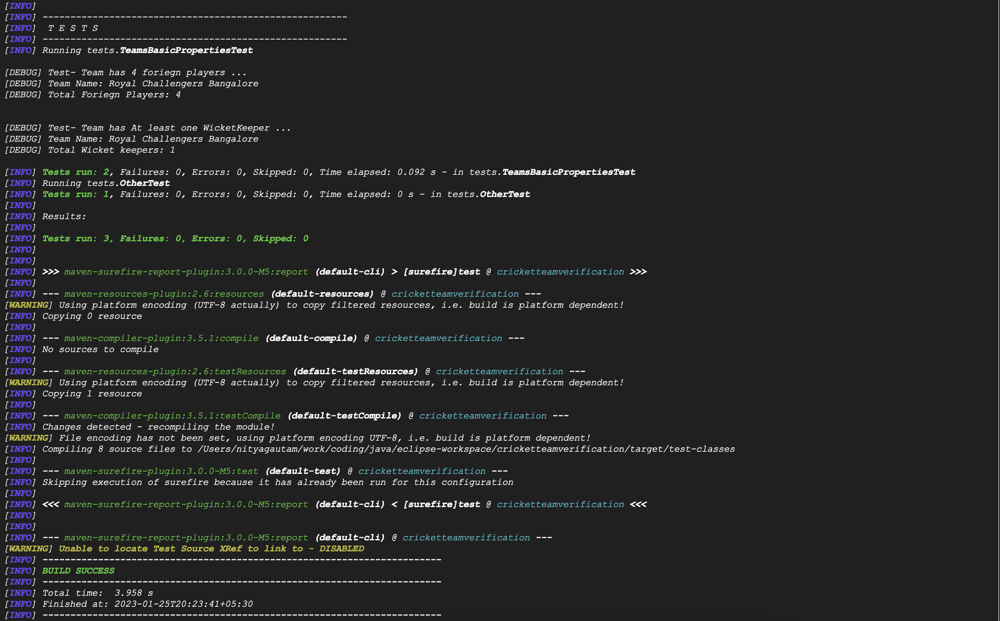

# Test Assignment Solution 

##### Assignment Link that has been followed for this solution
> https://docs.google.com/document/d/10rQVQzm30yyyAtbD5jpOIRmyG0q8fX-cI7CI9kG82Do/edit#

##### Technology used
> Java, JUnit, Maven

##### Tools needs to be installed on the machine (and make sure they are on the system's PATH)
> Java(>=7), Maven, Git

##### How to setup the project
> Just run the following command from terminal:

- `git clone https://github.com/nityagautam/cricketteamverification.git`
	
- `cd cricketteamverification`

##### How to Execute (from the command line)
> Just run the following command:

- `mvn clean test surefire-report:report`

after running the above command, you should be able to see the following result

##### How to Execute (from the Jenkins)
- Create a sample Job
- then add the `mvn clean test surefire-report:report` command in the 'build' step

##### How to setup the test-data (a JSON file having all the data to verify)
- Just place your test data JSON file inside the `./src/test/resources/YOUR_FILE.JSON`
- then update your file in the `./src/test/java/config/config.java` accordingly

##### Where to find the test result
- We can find the test results at `./reports/surefire-report.html` accordingly

